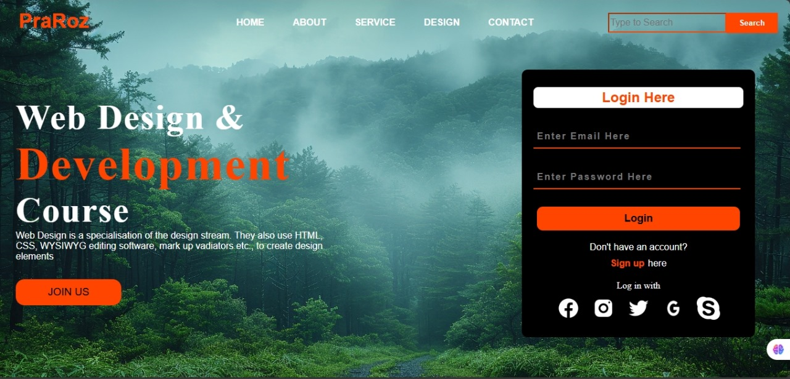

# Web Design & Development Landing Page

A clean and modern landing page designed for a **Web Design & Development Course**.  
This project focuses on **UI layout, visual styling, typography**, and a functional **login panel**, all built using **HTML & CSS** only.

---

## 🔥 Code Preview
🔗 **GitHub Repo:** https://github.com/ShanshahHasnain/web-design-landing-page

---

## 📸 Preview



---

## ⭐ Features

- ✔ Modern and clean UI layout  
- ✔ Navigation bar with menu links  
- ✔ Hero section with banner text  
- ✔ Call-to-action **Join Us** button  
- ✔ Login panel with Email & Password fields  
- ✔ Social media icon buttons  
- ✔ Consistent orange/white/black theme  

---

## 🛠️ Technologies Used

| Technology | Purpose |
|-----------|---------|
| **HTML5** | Page Structure |
| **CSS3**  | Styling & UI Design |

---

## 📂 Folder Structure
project-folder
│
├── index.html
├── styles.css
├── assets


---

## 🚀 How to Run

1. Clone the repository:
```bash
git clone https://github.com/ShanshahHasnain/web-design-landing-page

2. Open the project folder.

3. Run the website by opening:

index.html

